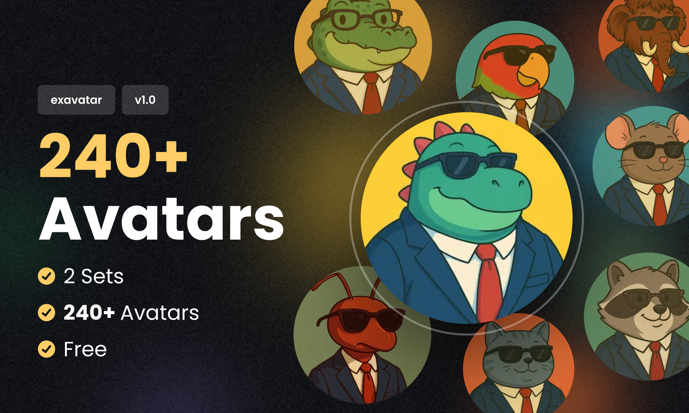
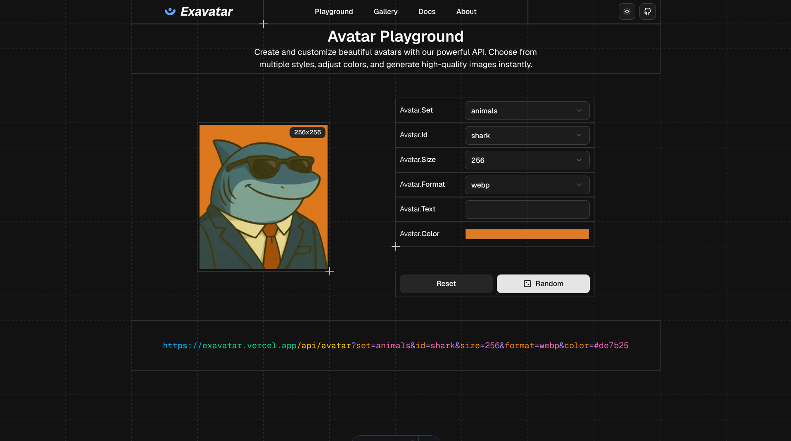
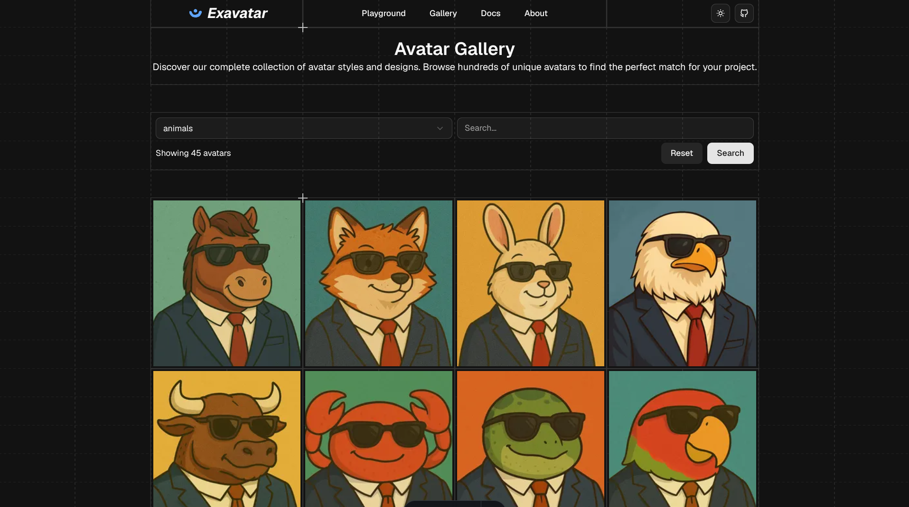
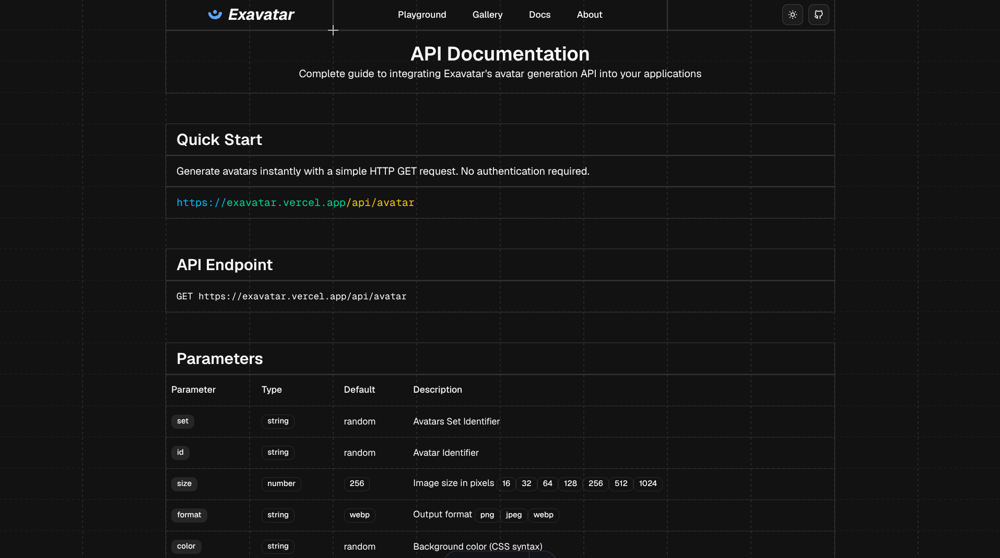
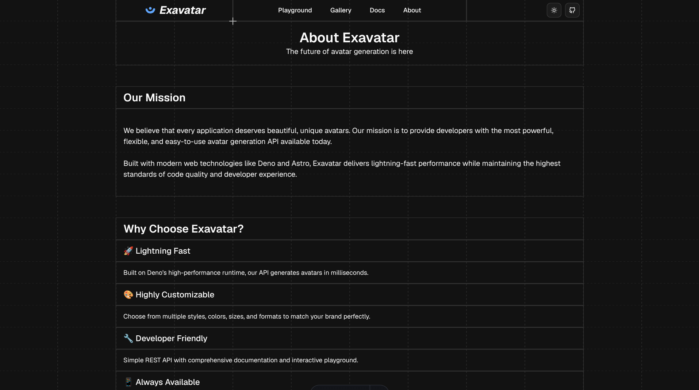
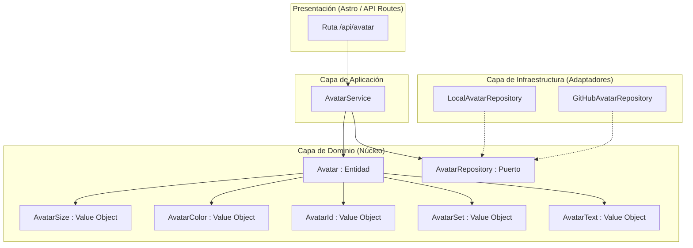
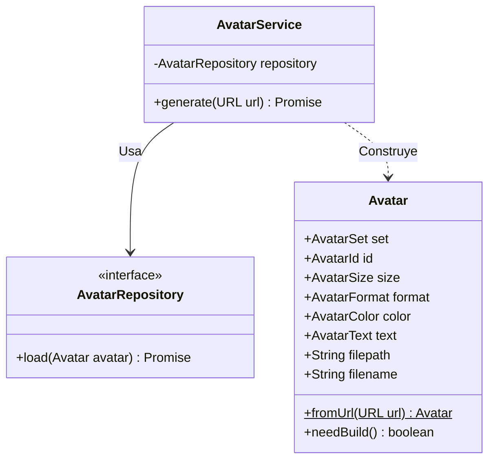

  

<h1 align="center">
  Exavatar: Generación de Avatares de Usuario
</h1>

## Capturas

---

Este documento detalla la arquitectura, el diseño de dominio y la implementación técnica de Exavatar, un motor de renderizado y API de generación de avatares dinámicos. Esta solución aborda una fricción recurrente en el desarrollo de aplicaciones web y móviles: la gestión de imágenes de perfil por defecto o *placeholders* cuando el usuario final omite proveer una.

## Utilidad y Flujo de Trabajo

El problema central que este proyecto resuelve es la ausencia de identidad visual temporal en interfaces de usuario, lo cual suele requerir que cada equipo de desarrollo implemente lógicas redundantes de generación de iniciales o carga condicional de imágenes en el cliente.

Exavatar traslada esa responsabilidad completamente al servidor. La herramienta actúa como una API REST que, mediante parámetros estructurados en la URL, devuelve instantáneamente un avatar, ya sea sirviendo un activo estático de una colección predefinida (por ejemplo, animales o personajes en formato WEBP/PNG) o generando un SVG al vuelo con las iniciales del usuario y un fondo de color.

El flujo principal de la aplicación opera de la siguiente manera:

1. **Recepción de la Petición:** Un cliente realiza una petición HTTP GET a la API con parámetros específicos (`set`, `id`, `size`, `format`, `color`, `text`).
2. **Evaluación de Dominio:** El núcleo de la aplicación interpreta los parámetros de la URL para instanciar la entidad principal (`Avatar`). Si se provee el parámetro `text`, la aplicación determina que debe compilar y devolver un SVG generado dinámicamente. De lo contrario, valida los atributos de tamaño, colección y formato para formar una ruta de archivo válida.
3. **Resolución de Repositorio:** Dependiendo del entorno de ejecución (Desarrollo vs. Producción), la capa de aplicación delega la carga física de la imagen al adaptador de infraestructura correspondiente (local o basado en red).
4. **Respuesta:** El servidor devuelve el binario de la imagen o el string SVG con las cabeceras HTTP correctas y el caché configurado, minimizando la carga computacional en peticiones subsiguientes.

---

## Análisis Profundo: Arquitectura y Modelado de Datos

El diseño del código fuente (ubicado principalmente en `src/core/`) es una implementación estricta de **Domain-Driven Design (DDD)** estructurada bajo el patrón de **Arquitectura Hexagonal (Ports and Adapters)**. Esta decisión técnica no es casualidad; se adoptó para aislar completamente la lógica de negocio y las reglas de generación de la capa de presentación (Astro) y de la capa de infraestructura (red/sistema de archivos).

### Arquitectura General

La separación de responsabilidades garantiza que el núcleo (`domain`) no tenga dependencias externas, haciendo el código inherentemente testeable y escalable.

### Modelado de Datos y Lógica de Negocio

La lógica de negocio reside en los *Value Objects* y en la entidad *Aggregate Root* (`Avatar`). Estos garantizan que la aplicación nunca procese un estado inválido.

- **Entidad `Avatar`:** Orquesta la validación y transformación. Expone el método `needBuild()`, el cual determina de forma inteligente el flujo de ejecución (lectura de archivo estático vs. generación de SVG) evaluando si el Value Object `AvatarText` contiene un valor válido.
- **Value Objects:**
  - `AvatarSize`: Valida los límites y resoluciones permitidas (ej. restringiendo entre 16px y 512px).
  - `AvatarColor`: Normaliza valores hexadecimales y calcula lógicas secundarias (como el contraste de texto automático para el SVG basado en la luminancia del color de fondo).
  - `AvatarId`, `AvatarSet` y `AvatarFormat`: Aseguran que el identificador solicitado pertenezca a una colección válida y que el formato de salida sea soportado (`webp`, `png`, `svg`).

El servicio orquestador, `AvatarService`, aplica inyección de dependencias mediante el constructor. En tiempo de ejecución, el sistema inyecta `GitHubAvatarRepository` para buscar estáticos en el repositorio de producción, o `LocalAvatarRepository` para leer desde el disco local durante el desarrollo.

### Stack Tecnológico

La pila de herramientas fue seleccionada estrictamente por rendimiento y control de tipos.

| Tecnología | Rol en la Arquitectura |
| :--- | :--- |
| **Astro** | Framework de presentación y *Server-Side Rendering* (SSR). Maneja el enrutamiento API y entrega respuestas ultra-rápidas a través del Edge Network sin inyectar JavaScript en el cliente. |
| **TypeScript** | Lenguaje principal. Fundamental para el modelado en la capa de Dominio, asegurando el cumplimiento riguroso de las interfaces entre puertos y adaptadores. |
| **Vitest** | Entorno de pruebas unitarias. Permite probar la capa de dominio y `AvatarService` de forma completamente aislada, inyectando repositorios simulados (*mocks*). |
| **BiomeJS** | Única herramienta de análisis estático (*linter*) y formateador. Configurada para usar indentación de tabulaciones y comillas simples, reemplazando completamente a Prettier y ESLint para mayor velocidad de ejecución. |
| **Vercel** | Infraestructura de despliegue. Utiliza *Serverless/Edge Functions* mediante `@astrojs/vercel` para procesamiento y entrega CDN global de las imágenes generadas. |

---

La integración rigurosa de principios DDD, tipado estático avanzado y una arquitectura hexagonal pura en un entorno JavaScript moderno resulta en un sistema con un acoplamiento nulo entre su motor de renderizado y su infraestructura de distribución de archivos. Esta abstracción permite escalar, cambiar de plataforma de alojamiento o añadir nuevos formatos de generación algorítmica sin requerir alteraciones en la lógica de dominio.
